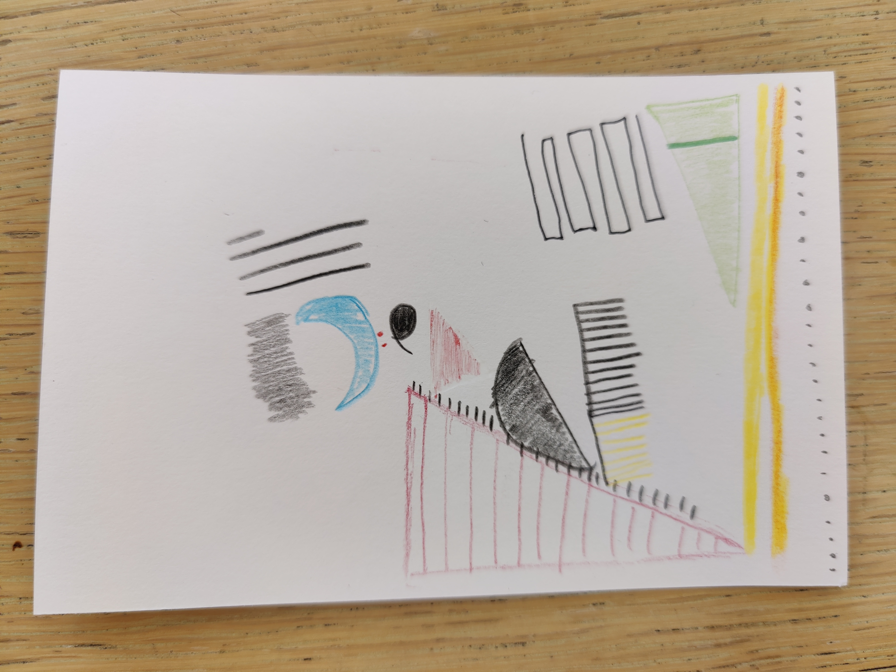

# Alejandro Navarrete

I am from Detroit, MI. Currently, I'm working as a Data and Research Manager for a local grassroots political organization. I decided to enter the career of data science in the public policy realm after learning to manage data and code while working with other local nonprofits during and after my undergrad studies. On the weekends I like to smoke meat and take my daughter to the park and petting zoos. I'm currently studying for my MS-CAPP. 